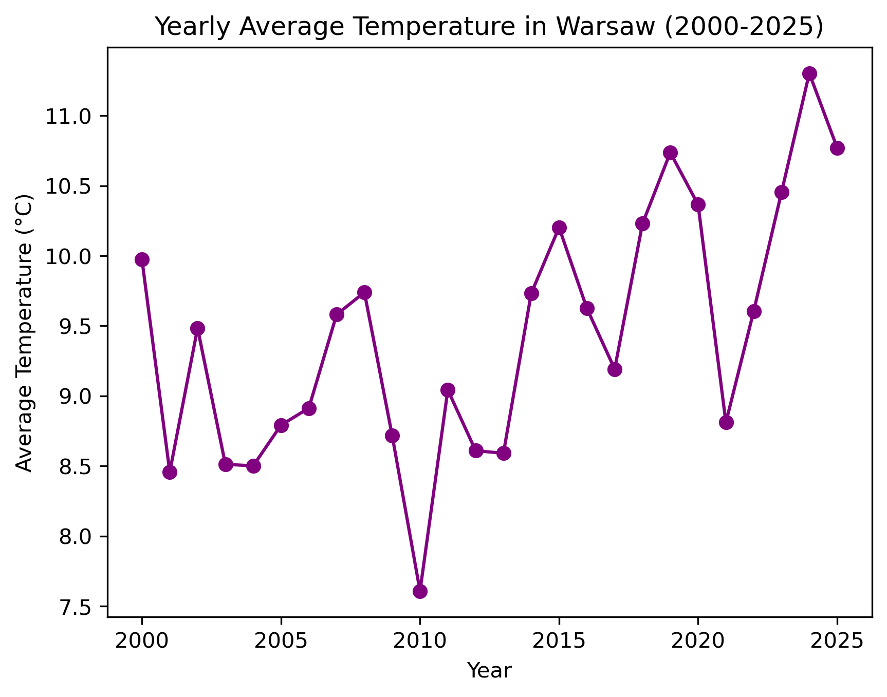
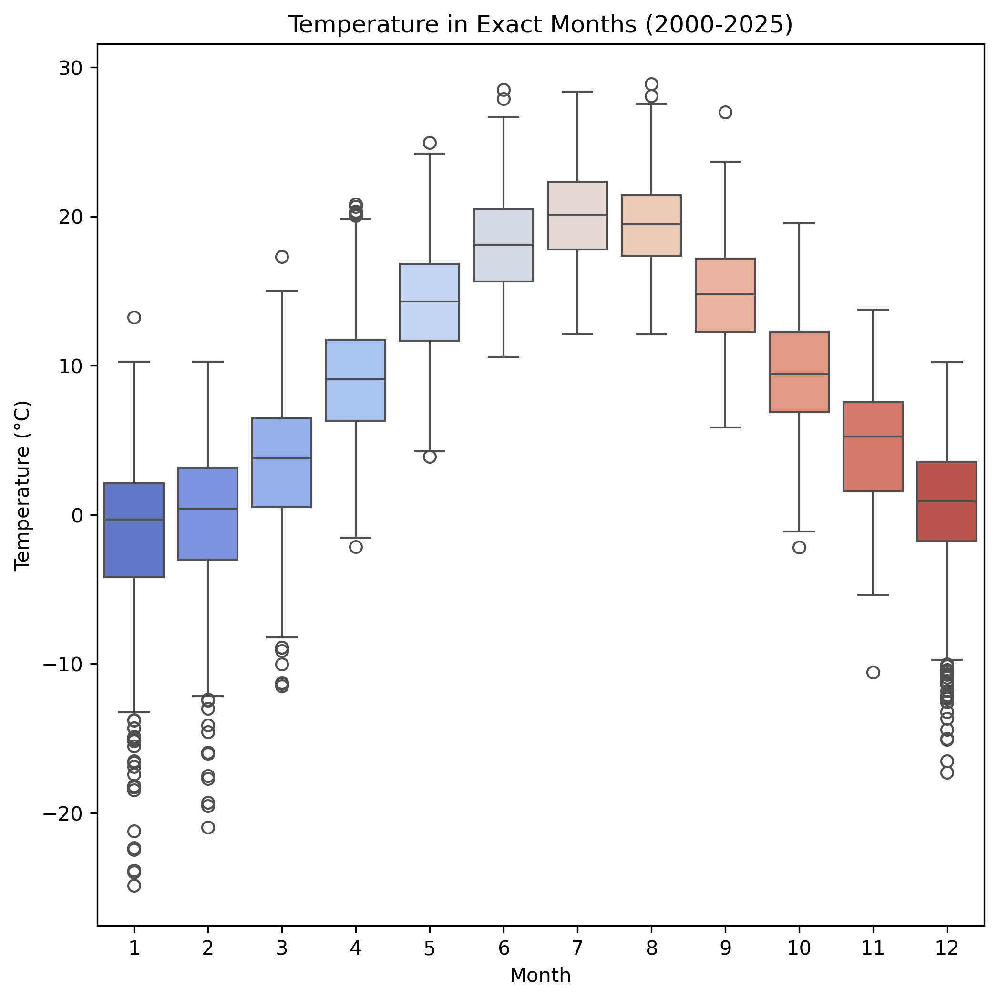
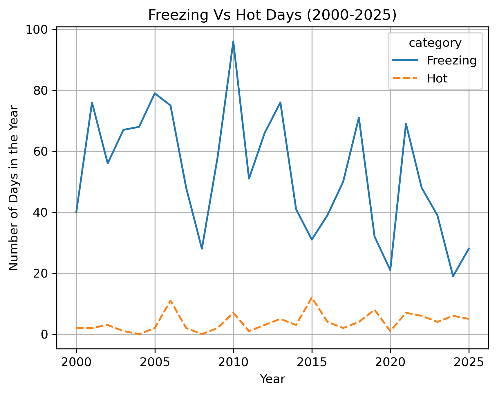
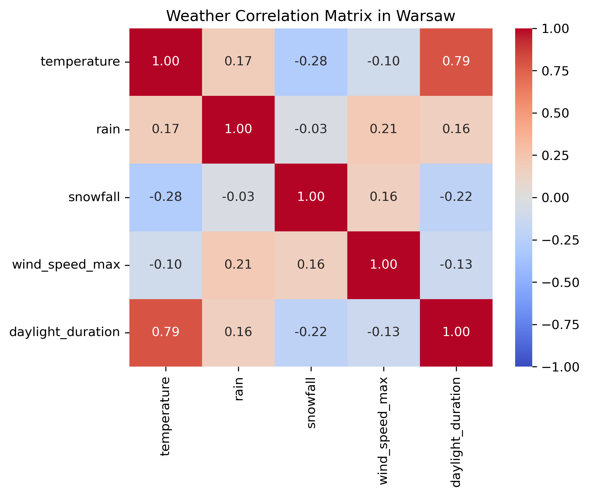
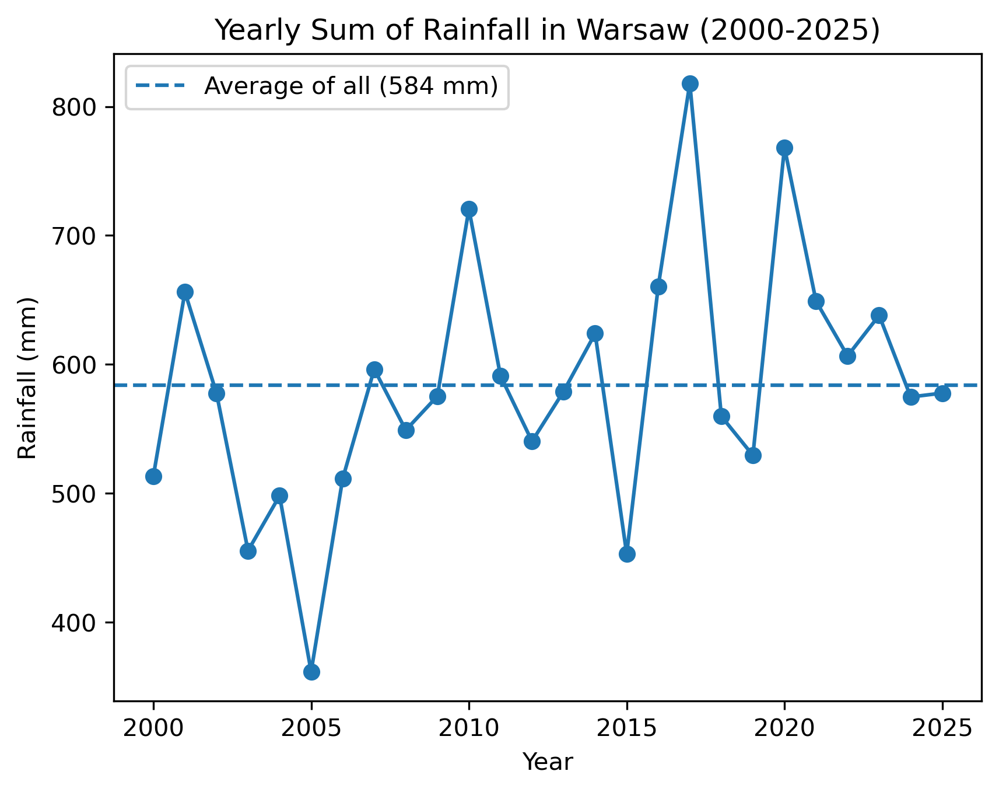

# Warsaw Weather Analysis (2000-2025)

## Project Overview
This project focuses on analyzing historical weather data for **Warsaw, Poland**, spanning the last 25 years (2000–2025). The goal was to investigate climate trends, specifically global warming signs, seasonality patterns, and extreme weather events.

The entire data processing pipeline—from API extraction to cleaning and visualization—was built using **Python**.

## Key Insights & Visualizations

### 1. The Warming Trend 
Analysis of yearly average temperatures confirms a visible upward trend. The chart below shows the rise in average temperatures, especially noticeable after 2010.



### 2. Seasonality & Variability 
Using a Boxplot, I analyzed the temperature distribution for each month.
* **January** shows the highest variability with extreme outliers (severe frosts).
* **Summer months (June-August)** are much more stable.



### 3. The Disappearing Winter 
By categorizing days into "Freezing" (<0°C) and "Hot" (>25°C), I tracked the frequency of extreme days. The data shows a significant drop in the number of freezing days per year over the last two decades.



### 4. Correlations (Heatmap) 
I examined the relationship between different weather variables. The strongest positive correlation (**0.79**) was found between **Temperature** and **Daylight Duration**, confirming strong seasonality. Interestingly, rainfall shows a very weak correlation with temperature.



### 5. Precipitation Analysis (Rain & Snow) 
The yearly sum of rainfall varies significantly, allowing identification of drought years versus years with heavy precipitation. Additionally, snowfall data further supports the trend of milder winters.


*(Snowfall data chart is also available in the `Plots/` folder)*

## Tech Stack
* **Language:** Python 3.x
* **Libraries:** Pandas, NumPy (Data Manipulation), Matplotlib, Seaborn (Visualization), Requests (API)
* **Data Source:** Open-Meteo API

## Data Source & Attribution
This project uses open-source weather data provided by **Open-Meteo.com**.
The data is licensed under **CC BY 4.0**.

* **Source:** [Open-Meteo Historical Weather API](https://open-meteo.com/en/docs/historical-weather-api)
* **Attribution:** Weather data by [Open-Meteo.com](https://open-meteo.com/)
* **License:** [Creative Commons Attribution 4.0 International (CC BY 4.0)](https://creativecommons.org/licenses/by/4.0/)

## How to Run
1.  Clone the repository.
2.  Install dependencies:
    ```bash
    pip install pandas matplotlib seaborn openmeteo-requests requests-cache retry-requests
    ```
3.  Run the analysis script:
    ```bash
    python weather_analysis.py
    ```